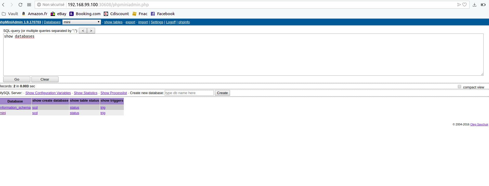

# k8s-helming: Deploy A PHP Application On Kubernetes With Helm

Run a custom PHP application (PHP-FPM), MySQL database (with persistent disk and secret credentials) and Nginx server on Kubernetes with Helm charts.

# Introduction
This README walks you through the process of running an example PHP (PHP-FPM) application on a Kubernetes cluster.
This solution allows you to automate the deployment, the scaling and management of the application containers.

The first step is to obtain the application source code, Dockerfile and the docker-compose.yml file
and use them as a starting point for creating a custom Helm chart to automate the application deployment in a Kubernetes cluster. 

# Steps:
To create your own application in PHP-FPM and deploy it on Kubernetes using Helm, you will typically follow these steps:

1.  Obtain the application source code
2.  Build the Docker image
3.  Publish the Docker image
4.  Deploy the example application in Kubernetes

# Step 1: Obtain The Application Source Code

Clone the repository. This will clone the sample repository and make it the current directory:

* `$ git clone https://gitlab.com/aymen_segni/basic-k8s-helm.git`

* `$ cd basic-k8s-helm/`

In the **app** folder you will see a file named phpminiadmin.php. This is a small PHP application for accessing and managing MySQL databases which we will use as an example application.

# Step 2: Build The Docker Image

The source code already contains the Dockerfile and the docker-compose.yml file needed for this example.
Replace the **USERNAME** placeholder in the app/docker-compose.yml file with your Docker ID.

Build the image using the command below. Remember to replace the USERNAME placeholder with your Docker ID:

* `$ docker build . -t  USERNAME/phpfpm-app:0.1.0`

Run the docker-compose up command in order to create and start the containers:

* `$ docker-compose -f app/docker-compose.yml up`

Check if the application is running correctly by entering http://localhost/phpminiadmin.php in your default browser.

To log in to the application, you must connect first to the database. Click the “advanced settings” link and enter the information below. Then, click “Apply”.
*  DB user name: test
*  Password: test
*  DB name: test
*  MySQL host: mariadb
*  port: 3306

# Step 3: Publish The Docker Image

To upload the image to Docker Hub, follow the steps below:

* Log in to Docker Hub: `$ docker login`
* Push the image to your Docker Hub account. Replace the USERNAME placeholder with your Docker ID:

`$ docker push USERNAME/phpfpm-app:0.1.0`

# Step 4: Deploy The Example Application In Kubernetes 

Move into the **helm-chart** directory by executing the command :

`$ cd helm-chart`

In the helm folder we have:

* Chart.yaml : This file includes the metadata of the Helm chart like the version or the description.
* values.yaml : This file declares variables to be passed into the templates. It is important to replace the **USERNAME** with your Docker ID, and also to check if the container name and version exist.

```
image:
repository: USERNAME/phpfpm-app
tag: 0.1.0
```


Using the helm install command, we will create three pods within the cluster, one for the Nginx service,

another for the MariaDB service with a persistent disk (**Persistent Volume Claims**: phpfpm-mariadb with 8Gi Storage), and the third for the PHP-FPM application.

Also we will create a **K8S Secret object** with Opaque type to store the Database credentials: mariadb-password: xxxxx & mariadb-root-password: xxxxx


## Deploy the app with helm:

First, make sure that you are able to connect to your Kubernetes cluster by executing the command below:

`$ kubectl cluster-info`

To deploy the example application in K8S, we use the Helm CLI: install 

`$ helm install --set mariadb.mariadbRootPassword=mini,mariadb.mariadbUser=mini,mariadb.mariadbPassword=mini,mariadb.mariadbDatabase=mini --name phpfpm .`

**NOTE:**
* The database name, root password, and user credentials have been specified by adding the --set options, and the chart name is specified by adding the --name option.
* The `mini` values is a placeholders for the database root password, user credentials and database name respectively, remember to replace them with the right values.
Once the chart has been installed, you will see a lot of useful information about the deployment.

The application won’t be available until database configuration is complete. 

## Get the application URL

In Minikube, we can check the application service to get the application’s URL:

`$ minikube service phpfpm-php-app-nginx --url`

## Explore the app

Copy the **application url** from the last command output. then, using this value open **application url**/phpminiadmin.php in your default browser, 

and use the **right Mariadb credentials** (use the database service name:** phpfpm-mariadb** as the **MYSQL_HOST**) to access the phpminiadmin application.
Finally, we can read data  from the database by runnig the SQL query ike the list of tables, databases ... 



Congratulations! our PHP application has been successfully deployed on Kubernetes!


